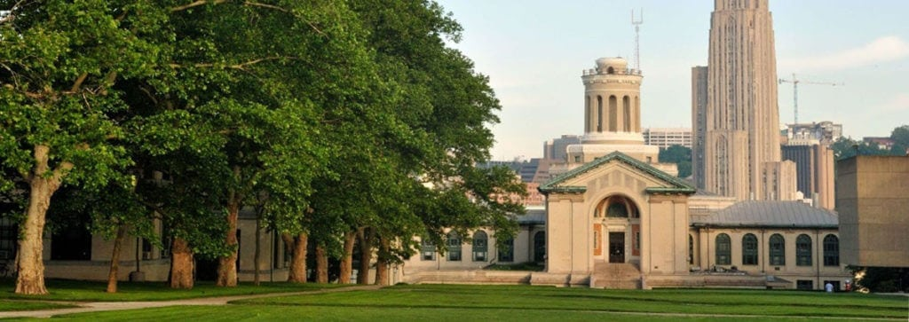

 <h1>Undergraduate Education</h1> 

    
## Bachelors of Arts/Science: Major 

University, College, City, State, Country

- **Graduated:** Month 20XX   
- List your achievements 
- **GPA:** 10.00  
- **Undergraduate Thesis**: "Title"    
- **Thesis Advisor**: [Dr. Vicki Helgeson](https://www.cmu.edu/dietrich/psychology/people/core-training-faculty/helgeson-vicki.html)

## Articles and News

- [A student feature](https://www.cmu.edu/dietrich/news/news-stories/2018/may/kim-hochstedler.html) from graduation
- List cool things you did

